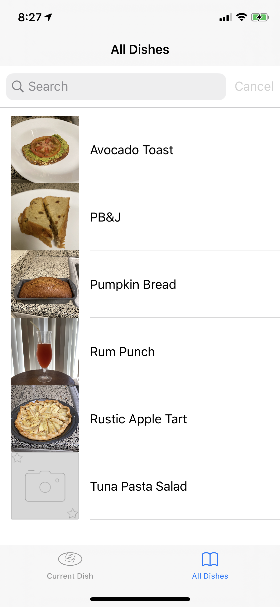

# ServingsUp, iOS Developer: Elias H.

**Run instructions:** Xcode 11.3.1, iOS Deployment Target: 12.4, iPhone 11 Pro, iOS deployment target: 13.2, version 1.2

**Overview:** ServingsUp, used by meal preparers, is an ingredient amount multiplier. By using the stepper, the user can change amounts, to reflect the dish item's number of servings

**Walkthrough:**
 In tab1 of the home view, the plus button adds ingredients, the stepper multiplies the ingredient amounts, the new/save button creates a new dish or renames the current dish, The camera takes a picture and assigns it to the dish. The garbage can button deletes dish. In tab2 of the home view, the user can see, search, delete dish. In tab1, when tapping the plus button and adding ingredient, the user inputs the name, amount, and unit. If the user taps on the cell in tab1 home view, the add ingredient view will present itself for user to input. Ingredients and Dishes are stored in Core Data

**Tools used: Xcode 11.3.1, UIKit, iPhone simulator/device, iPad simulator/device, Core Data **

**Select below for larger clearer image**

